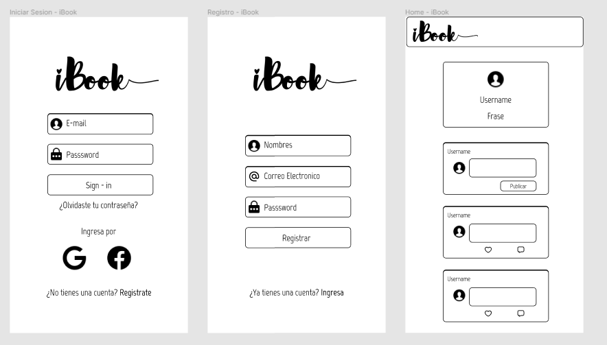
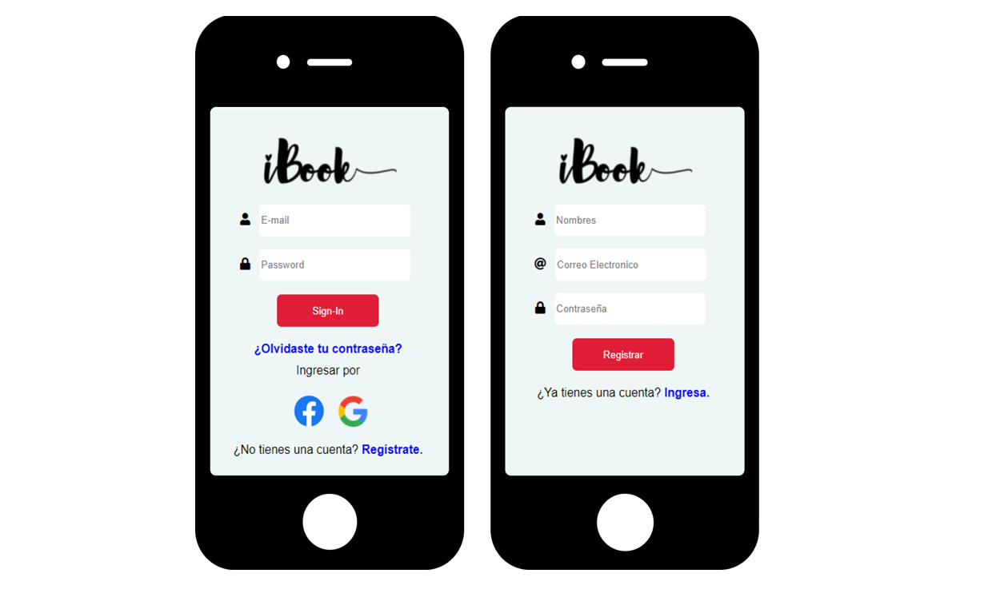
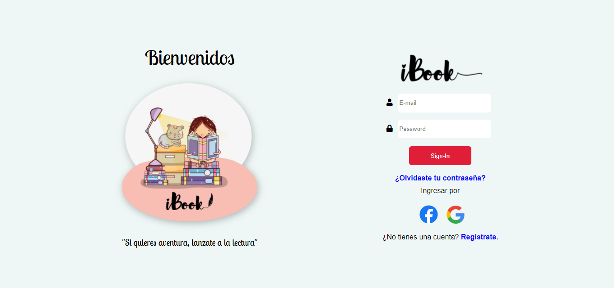
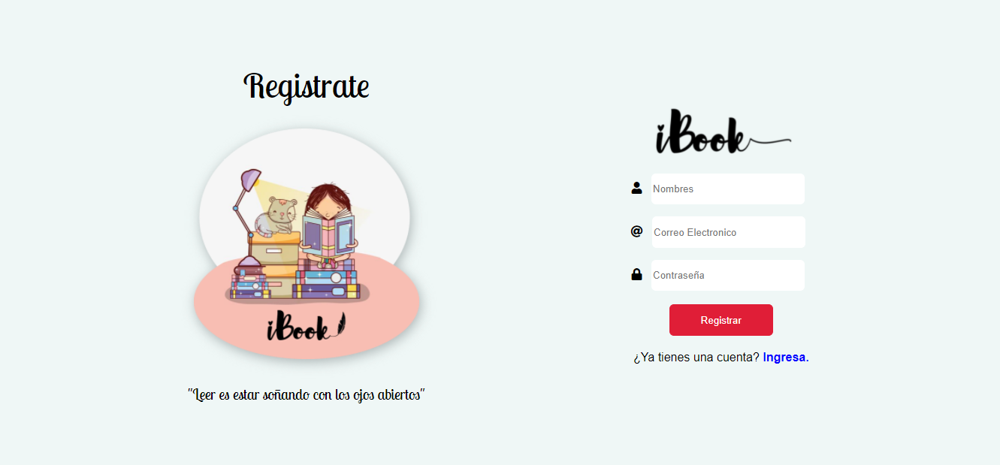

# iBook (Social Network)  &nbsp; 

## Índice

* [1. Integrantes](#1-integrantes)
* [2. Resumen del proyecto](#2-resumen-del-proyecto)
* [3. Definición del producto](#3-definicion-del-producto)
* [4. Diseño de la Interfaz](#4-diseño-de-la-interfaz)
* [5. Pruebas unitarias](#5-pruebas-unitarias)

## 1. Integrantes

Proyecto elaborado por [Melisa Gutierrez](https://github.com/JackelinGM), [Pamela Rupay](https://github.com/Alemapyapur) y [Rocio Sulca](https://github.com/RocioSulca).

## 2. Resumen del proyecto

iBook es una red social, que ayudara a fomentar una comunidad de lectura, iBook permitir a cualquier usuario crear una cuenta de
acceso y loguearse con ella; crear, editar, borrar y _"likear"_ publicacciones.

## 3. Definición del producto

¿Quiénes son los principales usuarios del producto?
Toda persona que les guste la lectura, de cualquier genero: juvenil, historico, fiction, etc.

¿Qué problema resuelve el producto / para qué le servirá a estos usuarios?
.

## 4. Diseño de la Interfaz

### 4.1 Diseño de la Interfaz de Usuario (prototipo de baja fidelidad)

### 4.2 Diseño de la Interfaz de Usuario (prototipo de alta fidelidad)

Mobile

Desktop

## 5. Pruebas unitarias (unit tests)

* Los tests unitarios llegaron a cubrir un mínimo del 70% de _statements_, _functions_,
  _lines_, y _branches_.

### 5.1 Consideraciones técnicas UX

* Se realizo 10 entrevistas con usuarios.
* Se verifico el prototipo de baja fidelidad.
* En sesiones de _testing de usabilidad_ a los usuarios.